# DealFrame — Video → Negotiation Intelligence

> Turn any recorded call, demo, or meeting into structured, machine-readable intelligence — instantly.

[](https://python.org)
[](https://fastapi.tiangolo.com)
[](https://react.dev)
[](#)

---

## What it does

Upload a video → get back topics, sentiment, risk scores, objections, decision signals, speaker breakdown, and AI-generated summaries. All in one pipeline.

---

## Screenshots

<table>
  <tr>
    <td align="center">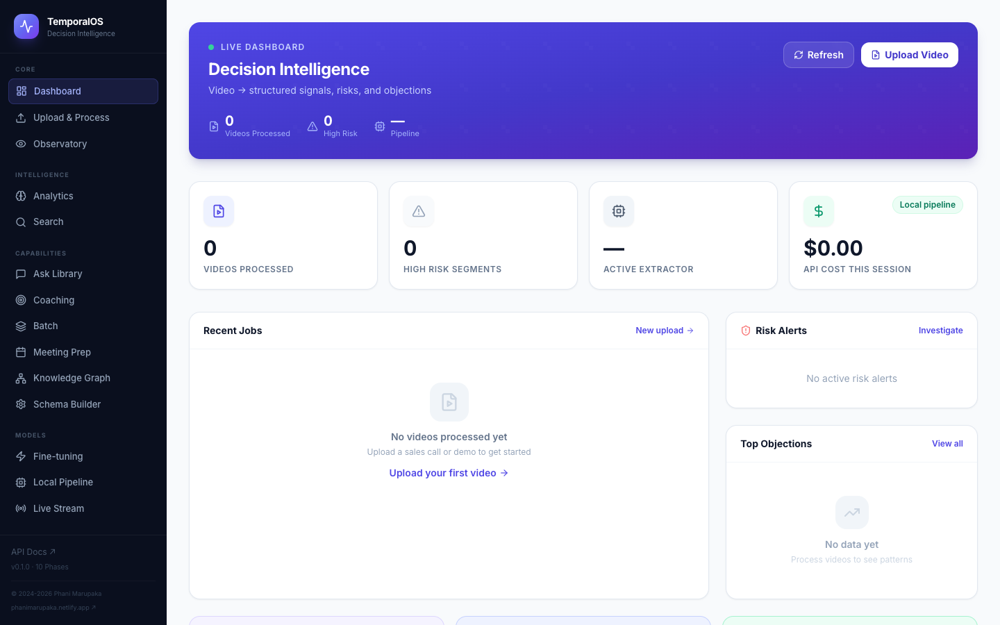<br/><sub><b>Dashboard</b></sub></td>
    <td align="center">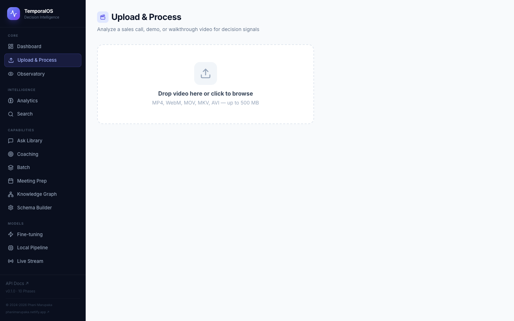<br/><sub><b>Upload &amp; Process</b></sub></td>
  </tr>
  <tr>
    <td align="center">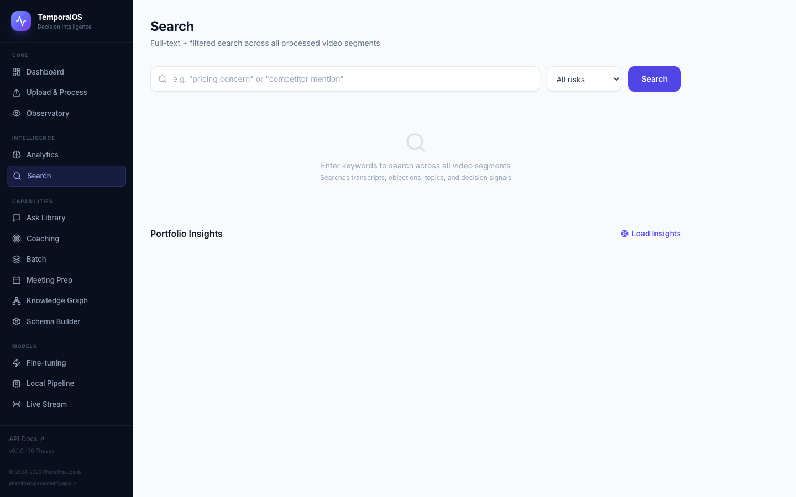<br/><sub><b>Semantic Search</b></sub></td>
    <td align="center">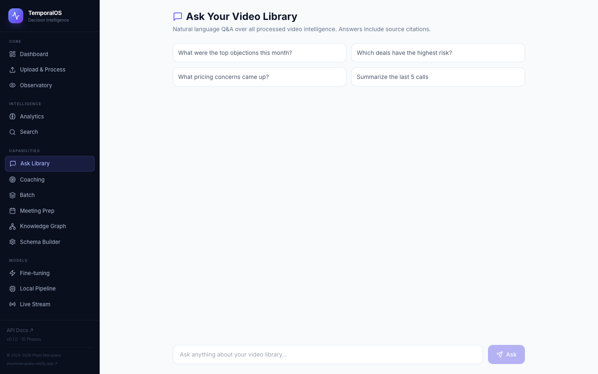<br/><sub><b>Ask Your Library (Q&amp;A)</b></sub></td>
  </tr>
  <tr>
    <td align="center">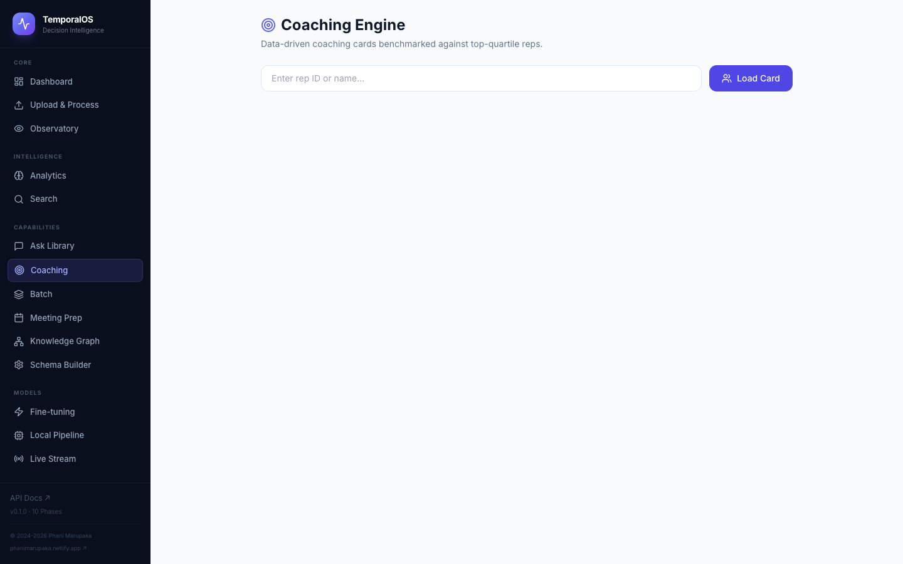<br/><sub><b>Rep Coaching Dashboard</b></sub></td>
    <td align="center">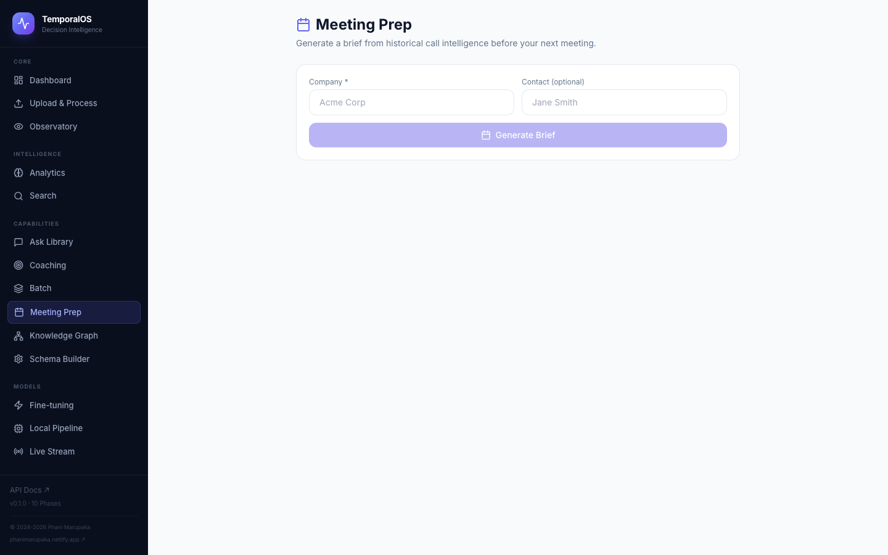<br/><sub><b>Meeting Prep Brief</b></sub></td>
  </tr>
  <tr>
    <td align="center">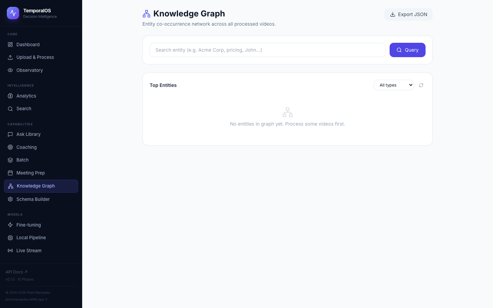<br/><sub><b>Knowledge Graph</b></sub></td>
    <td align="center">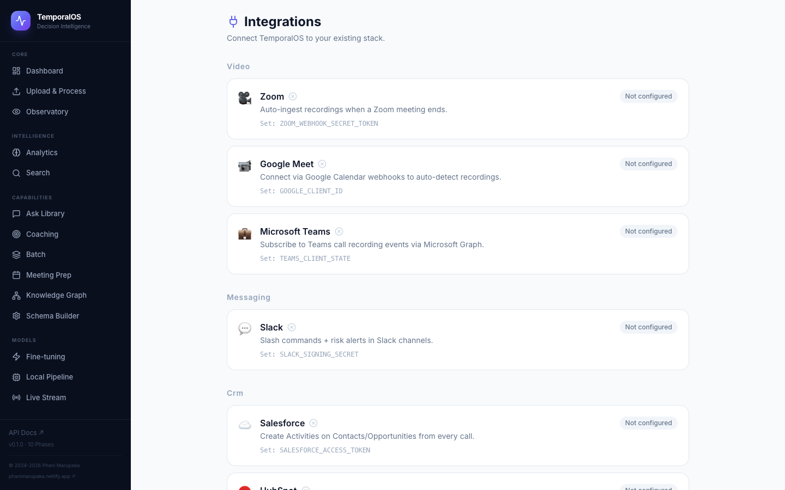<br/><sub><b>Integrations</b></sub></td>
  </tr>
  <tr>
    <td align="center">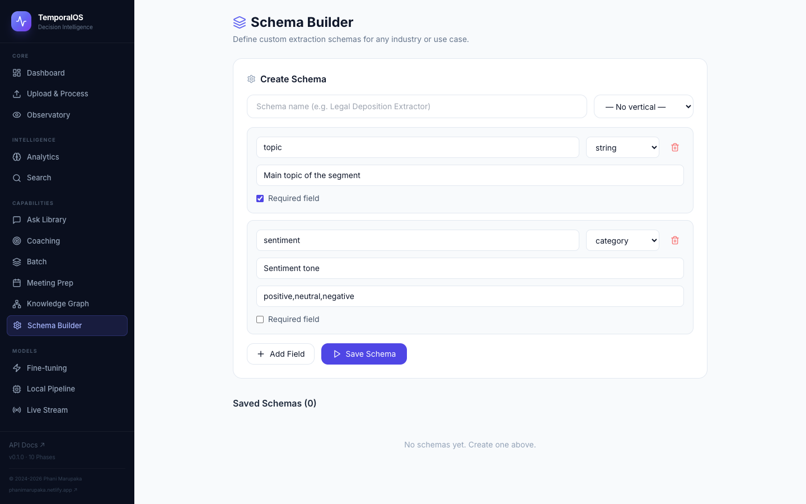<br/><sub><b>Schema Builder</b></sub></td>
    <td align="center">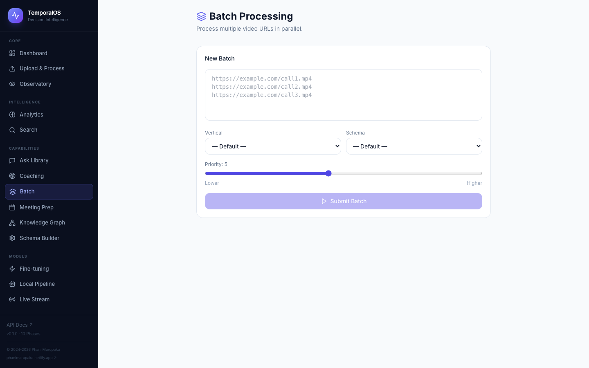<br/><sub><b>Batch Processing</b></sub></td>
  </tr>
  <tr>
    <td align="center" colspan="2">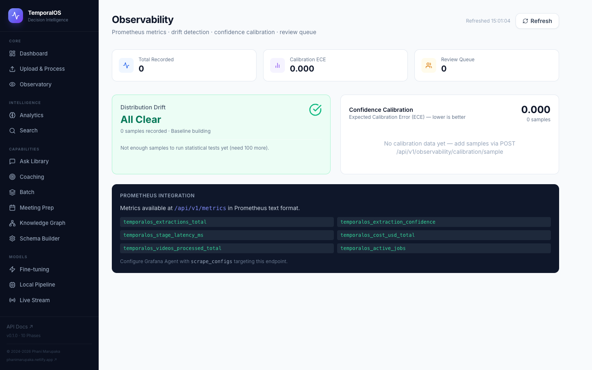<br/><sub><b>Observability &amp; Drift Detection</b></sub></td>
  </tr>
</table>

---

## Key Features

- **Video pipeline** — FFmpeg frame extraction + Whisper/Deepgram transcription + temporal alignment
- **Structured extraction** — Topics, sentiment, risk scores, objections, decision signals per segment
- **Speaker diarization** — Who said what and talk-time breakdown
- **Auto summaries** — Executive brief, action items, deal brief, QBR, UX research report
- **Clip extraction** — Pull the most significant moments as standalone clips
- **Verticals** — Pre-built packs for Sales, Procurement, UX Research, Customer Success, Real Estate
- **Custom schemas** — Build your own extraction schema with a drag-and-drop UI
- **Q&A over your library** — Ask natural language questions across all processed calls
- **Deal risk monitoring** — Real-time alerts when risk spikes or persists high
- **Rep coaching** — Per-rep scorecards across 5 dimensions with an overall grade
- **Meeting prep** — Auto-generated brief from historical call intelligence before you dial
- **Knowledge graph** — Entity co-occurrence network across your entire video library
- **Integrations** — Zoom, Google Meet, Teams, Slack, Notion, Salesforce, HubSpot, Zapier
- **Batch processing** — Async priority queue to process hundreds of URLs in parallel
- **Python SDK** — Zero-dependency stdlib-only client, fully typed
- **Observability** — OpenTelemetry traces, Prometheus metrics, model drift detection
- **Active learning** — Human-in-the-loop review queue with gating
- **Multi-agent orchestration** — RAG agent, copilot agent, autonomous workflows
- **Live copilot** — Real-time coaching signals during live calls
- **CI/CD** — GitHub Actions with lint, test, security scan (Bandit)
- **Security hardening** — HSTS, CSP, RBAC, JWT auth, audit trail

---

## Industry Verticals

TemporalOS ships with domain-specific extraction packs — each adds targeted keyword detection, schema fields, and enrichment logic on top of the core pipeline:

| Vertical | What It Extracts | Target Industries |
|---|---|---|
| **Sales** | Objections, pricing signals, deal stage, competitor mentions, champion detection, urgency | SaaS, Enterprise Sales, Insurance, Recruiting |
| **Procurement** | Pricing/concessions, commitment strength, supplier risk, SLA tracking, contract clause objections, TCO signals, compliance/ESG, maverick spend | Manufacturing, Automotive, Higher Ed, Public Sector, Healthcare, Energy |
| **UX Research** | Pain points, delight moments, confusion signals, feature requests, task success, severity | Product Management, UX Design, Market Research |
| **Customer Success** | Churn risk, expansion signals, health score, onboarding issues, NPS mentions | SaaS, Enterprise Software |
| **Real Estate** | Budget, property preferences, timeline urgency, financing status, showing feedback | Residential, Commercial Real Estate |

The **Procurement** vertical is designed to feed structured negotiation intelligence into Source-to-Pay platforms (Coupa, SAP Ariba, Jaggaer, GEP, Ivalua, etc.) — extracting the conversation data these platforms never capture.

---

## Quick Start

```bash
# 1. Clone
git clone https://github.com/Phani3108/TemporalOS.git
cd TemporalOS

# 2. Backend
pip install -e ".[dev]"
DATABASE_URL="sqlite+aiosqlite:///./dev.db" uvicorn temporalos.api.main:app --port 8000 --reload

# 3. Frontend (new terminal)
cd frontend && npm install && npm run dev

# 4. Open http://localhost:5173
```

Or with Docker:
```bash
cp .env.example .env   # configure your keys
docker compose up -d
# API: http://localhost:8000  |  Dashboard: http://localhost:3000
```

---

## Stack

| Layer | Tech |
|---|---|
| Video | FFmpeg, OpenCV, PySceneDetect |
| ASR | Whisper (local), Deepgram (streaming WebSocket) |
| Vision | GPT-4o / Claude Vision / Qwen-VL, Tesseract OCR |
| API | FastAPI, SQLAlchemy async, PostgreSQL, Alembic |
| Frontend | React 18, Vite, TailwindCSS, 25 pages |
| Storage | Local filesystem / S3 (MinIO for dev) |
| Auth | JWT + RBAC (admin/analyst/viewer) + multi-tenant |
| Observability | OpenTelemetry, Prometheus, drift detection |
| Fine-tuning | LoRA via HuggingFace PEFT, Unsloth |
| CI/CD | GitHub Actions, Docker Compose, Bandit security |

---

## Documentation

- [Architecture Overview](docs/architecture.md) — System design, module map, data flow
- [API Reference](docs/api-reference.md) — All endpoints with examples
- [Deployment Guide](docs/deployment.md) — Docker, env vars, production setup
- Interactive API docs: `http://localhost:8000/docs` (Swagger UI)

---

## Python SDK

```python
from temporalos_sdk import TemporalOSClient

client = TemporalOSClient("http://localhost:8000")
job = client.upload("meeting.mp4")
result = client.wait_for_result(job.job_id)

for segment in result.segments:
    print(f"{segment['topic']}: risk={segment.get('risk_score', 0)}")
```

---

## Tests

```bash
make test        # unit tests
make test-e2e    # end-to-end suite
pytest --cov=temporalos --cov-report=html   # with coverage
```

---

## Built by

**Phani Marupaka**  
[LinkedIn](https://linkedin.com/in/phani-marupaka) · [Portfolio](https://phanimarupaka.netlify.app)

© 2024-2026 Phani Marupaka. All rights reserved.
